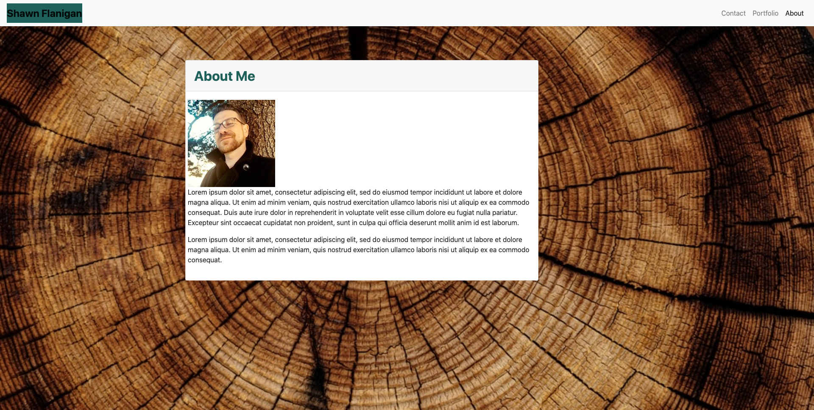
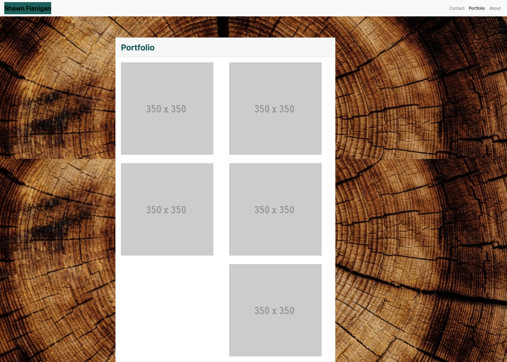

# The portfolio for Shawn Flanigan
## Table of contents
- [General Info](#general-info)
- [About Page](#about-page)
- [Portfolio Page](#portfolio-page)
- [Contact Page](#contact-page)
- [Technologies](#technologies)
- [Summary](#summary)
- [Author](#author)
## General Info
This is my intial portfolio which meets, but is not limited to, the following criteria:
* Functional, deployed application
* GitHub repository with README describing the project
* Navbar must be consistent on each page.
* Navbar on each page must contain links to Home/About, Contact, and Portfolio pages.
* All links must work.
* Must use semantic html.
* Each page must have valid and correct HTML. (use a validation service)
* Must contain your personalized information. (bio, name, images, links to social media, etc.)
* Must properly utilize Bootstrap components and grid system.
## About Page

## Portfolio Page

## Contact Page

## Technologies
This project is created with:
- [HTML](https://html.com/)
- [CSS](https://www.w3.org/Style/CSS/Overview.en.html)
- [Bootstrap](https://getbootstrap.com/)
- [Javascript] (https://www.javascript.com/)
## Summary
- This project is my own initial portfolio. I received help with my readme from Joshua Azzam Rehanek
## Author
- Shawn Flanigan
